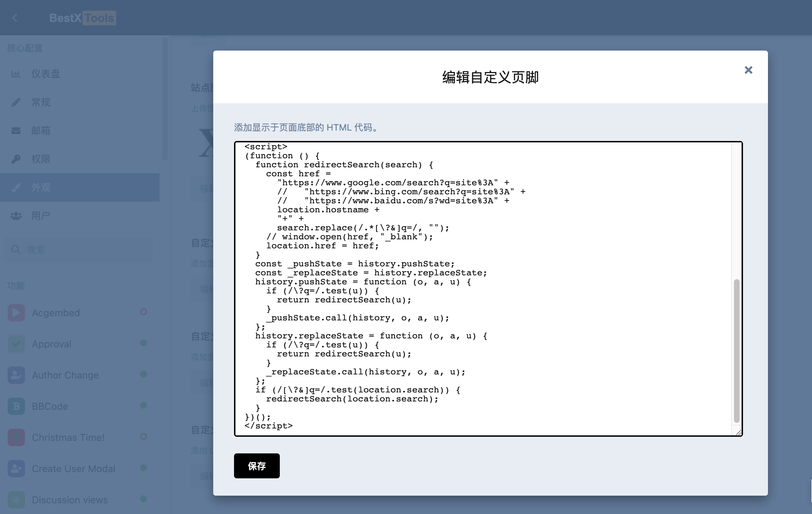

# flarum-redirect-search

Redirect flarum search pages to other search engines like google, bing, baidu.

将 flarum 的搜索页面自动跳转到其他搜索引擎（谷歌，Bing，百度）的 js 代码片段。

## Usage

1. 进入编辑：后台 > 外观 > 自定义页脚

2. 添加 `<script>` 标签，在标签里面添加 [`redirect.js`](redirect.js) 文件里面的代码，保存。
   ```html
   <script>
     // code ...
   </script>
   ```
3. 刷新页面，完毕。



## Other Flarum Extensions

- [flarum-ext-id-slug](https://github.com/PipecraftNet/flarum-ext-id-slug) - 让 Flarum 只用 id 作为 slug 的插件。([discuss](https://discuss.flarum.org.cn/d/2799), [extiverse](https://extiverse.com/extension/pipecraft/flarum-ext-id-slug))

## License

Copyright (c) 2023 [Pipecraft](https://www.pipecraft.net). Licensed under the [MIT License](https://github.com/PipecraftNet/flarum-redirect-search/blob/main/LICENSE).

## >\_

[](https://www.pipecraft.net)
[](https://dto.pipecraft.net)
[](https://www.bestxtools.com)
